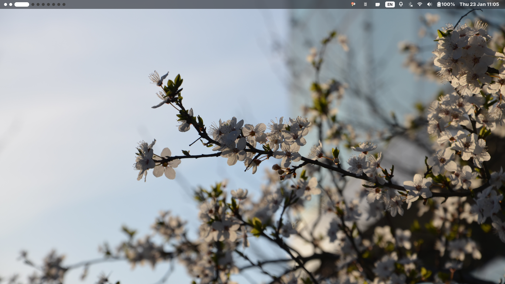
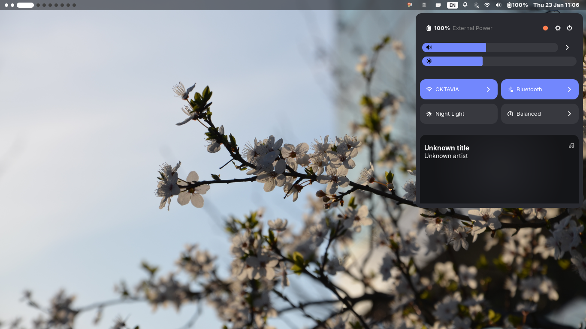
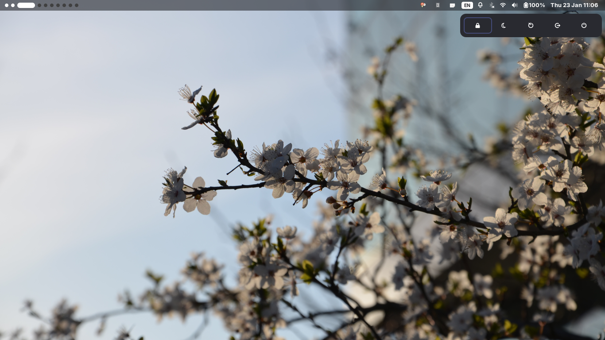
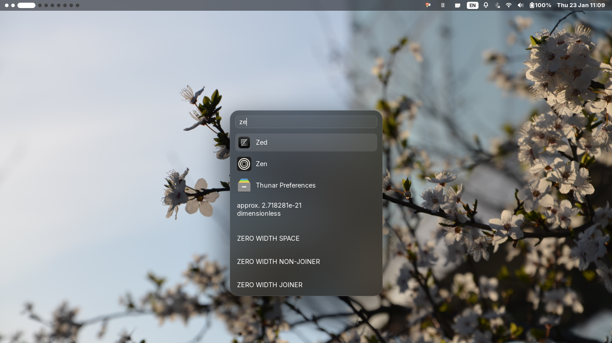

# My Personal Nixos Configs

## Screenshots

## Credits

big thanks to:  

- [@fufexan](https://github.com/fufexan/dotfiles): Check out their awesome dotfiles at [fufexan/dotfiles](https://github.com/fufexan/dotfiles)  
- [@ImRayy](https://github.com/ImRayy/ags-dots): Explore their amazing ags-dots repo at [ImRayy/ags-dots](https://github.com/ImRayy/ags-dots)  
- [@ImRayy](https://github.com/ImRayy/nixos-dots): Dive into their fantastic NixOS configurations at [ImRayy/nixos-dots](https://github.com/ImRayy/nixos-dots)  
- [@anewdi](https://github.com/anewdi/luicoBar): cool ags config [anewdi/luicoBar](https://github.com/anewdi/luicoBar)
